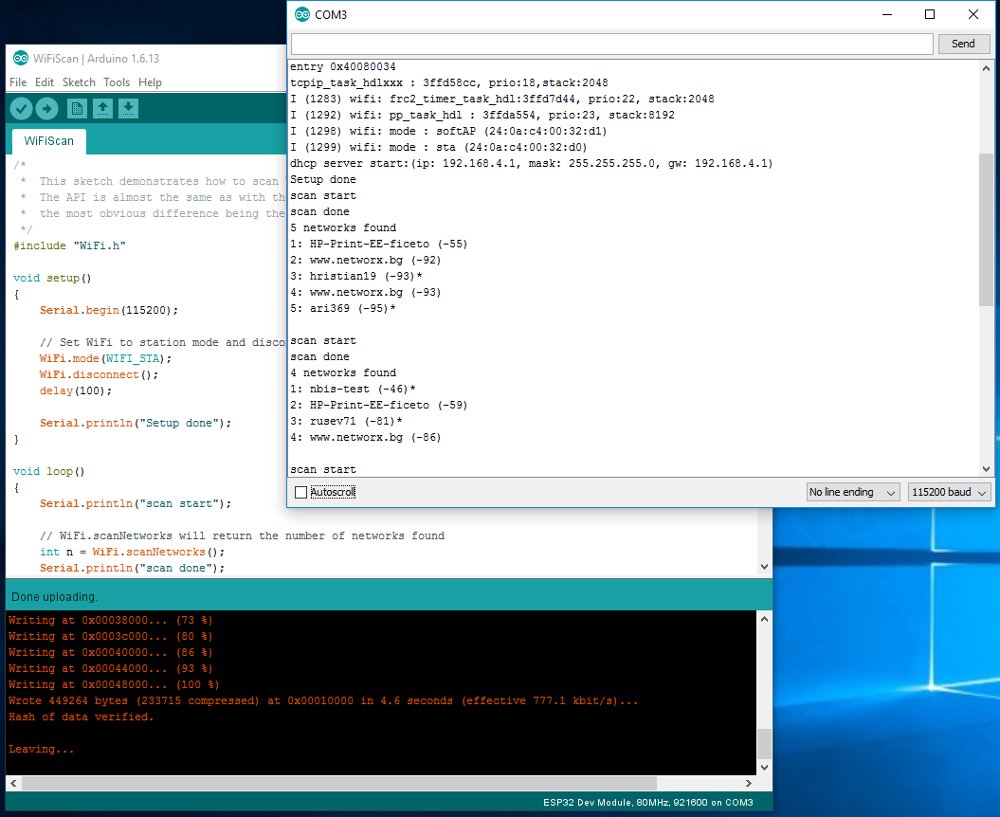

## Steps to install Arduino ESP32 support on Windows
### Tested on 32 and 64 bit Windows 10 machines

1. Download and install the latest Arduino IDE ```Windows Installer``` from [arduino.cc](https://www.arduino.cc/en/Main/Software)
2. Download and install Git from [git-scm.com](https://git-scm.com/download/win)
3. Start ```Git GUI``` and run through the following steps:
    - Select ```Clone Existing Repository```

        

    - Select source and destination
        - Source Location: ```https://github.com/Heltec-Aaron-Lee/WiFi_Kit_series.git```
        - Target Directory: ```/Documents/Arduino/hardware/heltec```
        - Change this to your Sketchbook Location if you have a different directory listed underneath the "Sketchbook location" in Arduino preferences.
        - Click ```Clone``` to start cloning the repository

            .png)
            

4. Open ```/Documents/Arduino/hardware/heltec/esp32/tools``` and double-click ```get.exe```

        

5. When ```get.exe``` finishes, you should see the following files in the directory

        

6. Plug your ESP32 board and wait for the drivers to install (or install manually any that might be required)
7. Start Arduino IDE
8. Select your board in ```Tools > Board``` menu ```WiFi_Kit_32```or ```WiFi_LoRa_32```
9. Select the COM port that the board is attached to
10. Compile and upload (You might need to hold the ```PRG``` button while uploading)

    

### How to update to the latest code

1. Start ```Git GUI``` and you should see the repository under ```Open Recent Repository```. Click on it!

    

2. From menu ```Remote``` select ```Fetch from``` > ```origin```

    

3. Wait for git to pull any changes and close ```Git GUI```
4. Open ```/Documents/Arduino/hardware/heltec/esp32/tools``` and double-click ```get.exe```

    
## Steps to install Arduino ESP32 support on Windows
### Tested on 32 and 64 bit Windows 10 machine
1. Install [Python](https://www.python.org/downloads/ )

2. Open ```/Documents/Arduino/hardware/heltec/esp8266/tools``` and double-click ```get.py```   
-  It can't work without ```Python```

    
   
3. Waiting for download...

   
   
4.  You'll find these files in ```dist``` after downloading

   
   
5. Plug your ESP32 board and wait for the drivers to install (or install manually any that might be required)

6. Start Arduino IDE

7. Select your board in ```Tools > Board``` menu ```WiFi_Kit_8```

8. Select the COM port that the board is attached to

9. Compile and upload (You might need to press the ```PRG``` button while uploading)

    


